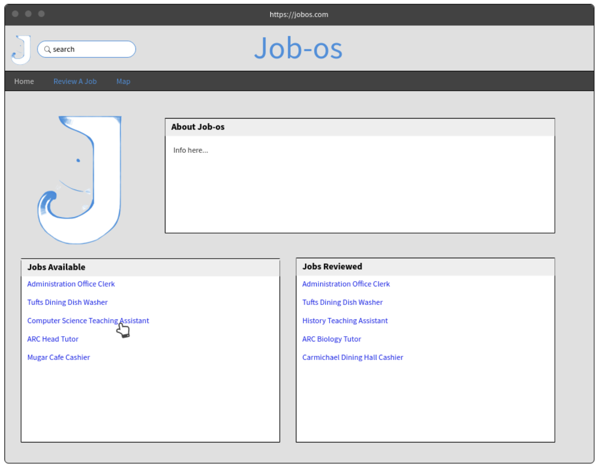
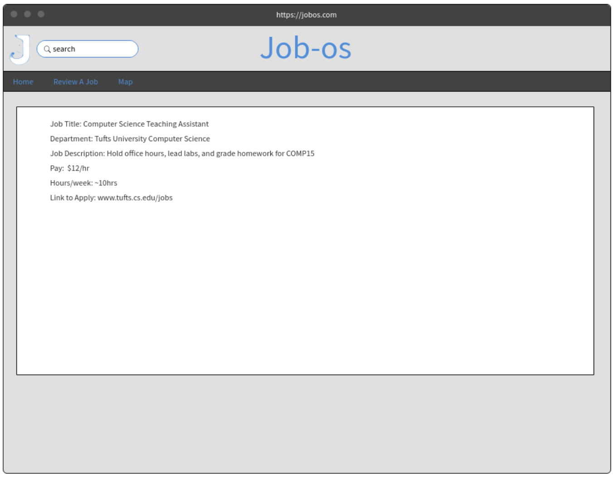
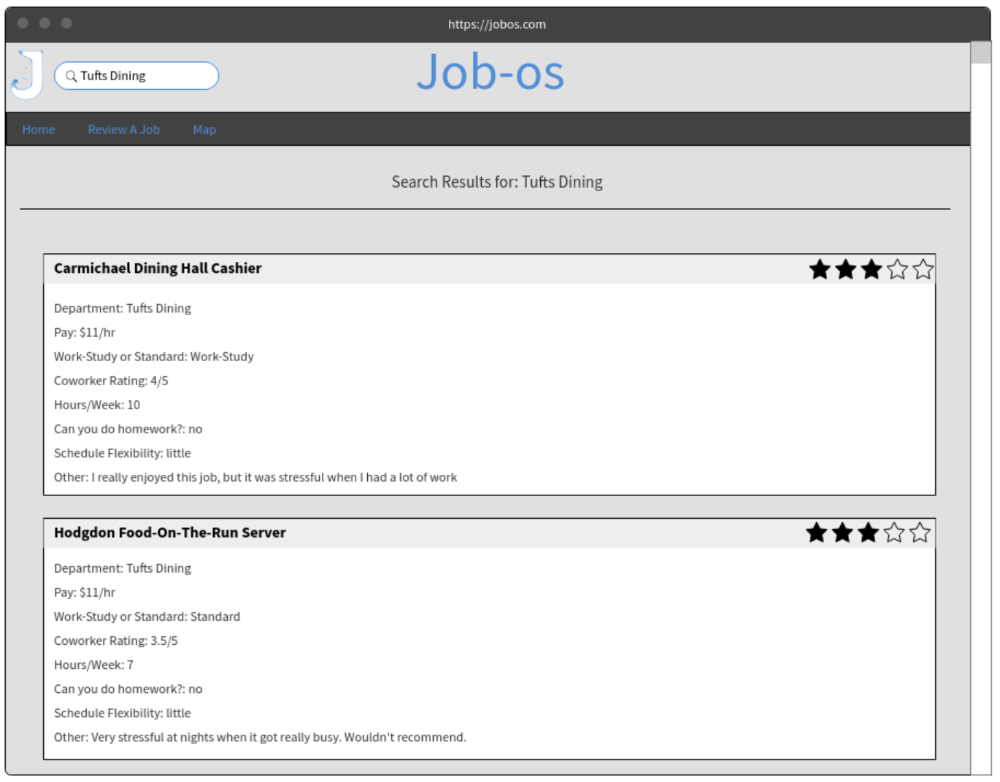
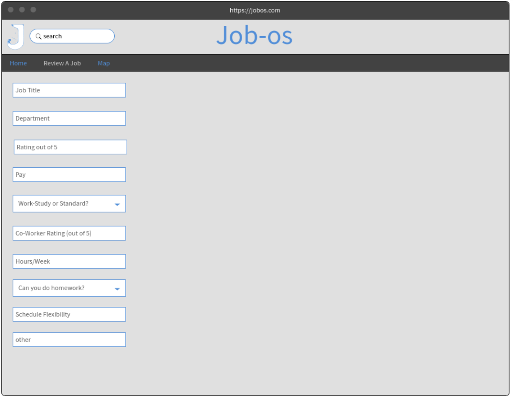
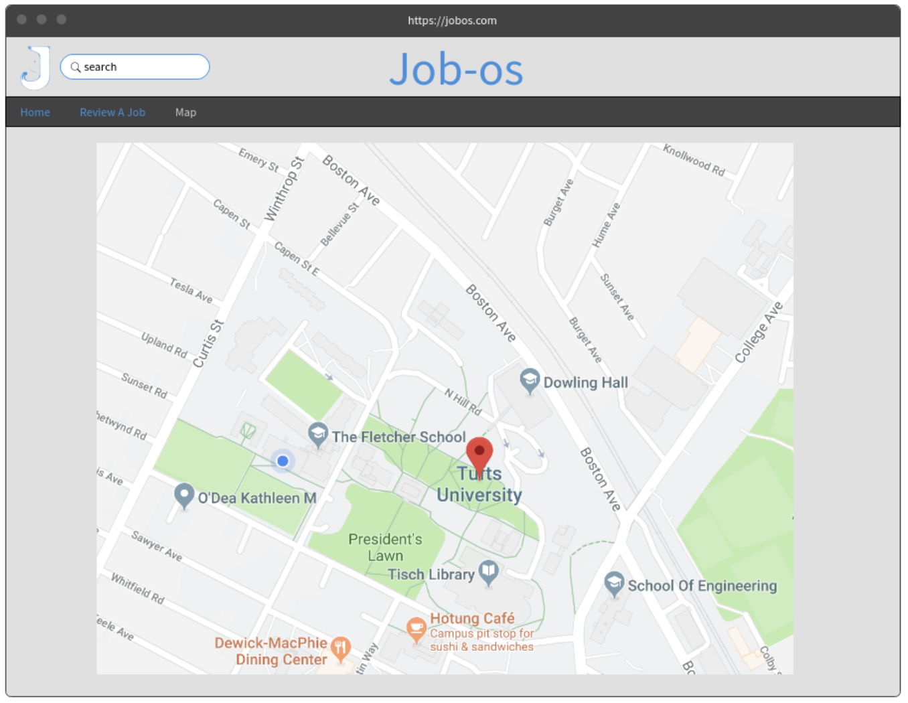
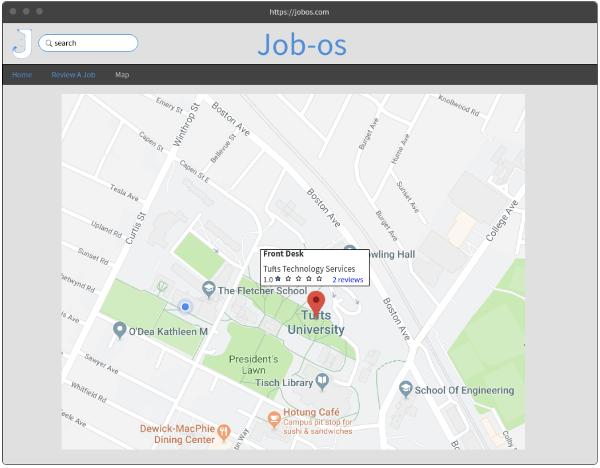

# COMP20 Project Proposal
## Web Programming, Ming Chow

### Team Six
Barry Eom * Julia Hedrick * Ben Solomon

### Project title

Job-os

### Problem statement

Tufts students do not have access to reliable information about on-campus jobs and opportunities. The current database (JobX) is limited in scope and data, providing only few details for open positions.

### How do you solve the problem?

“Glassdoor for on-campus jobs.” We plan to replace the current Tufts job portal with a more dynamic platform. By creating an accessible and useful system, we believe more people will become engaged in job searches. This increased use will make the job portal more effective for employers and students. Ideally, we hope to expand this platform to other campuses as well. Our features (listed below) will help accomplish this.
 
### Features

Job-os will include many features to improve the job-search experience, including:

* Search tool
	* Filters available jobs based on user-supplied keywords (“technology,” “arts,” “customer service,” etc.)
	* Allows sorting by:
		+ Average pay
		+ Work-study or standard
		+ Coworker rating
		+ Average time required/worked per week
		+ Allowed to do homework during downtime?
		+ Schedule flexibility (last minute shift drops, etc.)
	* Map
		+ Automatically plot available jobs on a map
		+ Clicking on a marker opens an information box about the job
			+ Title and department shown
			+ Link to full job listing
	* “Leave a Review” functionality
		+ On each job page, users will have the option to leave a review by clicking a button
		+ Reviews automatically ask for the search criteria above (average pay, etc.) so that searches will have accurate data

### Data

Our prototype will collect data about each on-campus job. This data is twofold: first, we will store general information about the job’s location, hourly pay, department, and more. We will separately store a collection of user reviews with the search criteria listed above. The basic job data will be reflected on each listing, while user comments will be shown at the bottom of the page and rating averages will appear in various locations.

### Algorithms and Special Techniques

Many of the techniques we will use are from course material. Assignment 2 already covered the Google Maps API, and in the future our class will learn the basics of permanently storing data for a website. These are both essential parts of the project. We do not anticipate using specialized techniques or complex algorithms to build Job-os.

Where necessary, we will perform simple rankings based on user feedback. These will correspond directly to numeric scores of each on-campus job. We can achieve this with a basic sorting algorithm and partitioning groups of data based on characteristics like “work study vs. standard.” One algorithm we may implement is job ranking based on user preference. For example, if a user prioritizes schedule flexibility, we may value this category more than others when displaying results. This will be implemented with a priority multiplier that produces overall rankings.

## Electronic Mockups

Home Page

After Click on Job Link

Search for a Job

Review a Job tab

Map Page (before marker click)

Map Page (after marker click)

